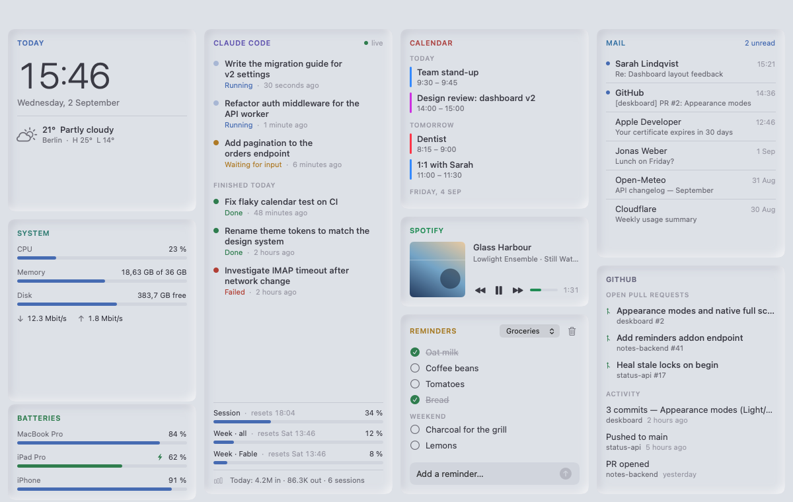
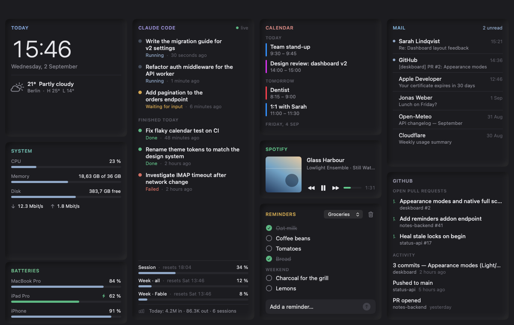
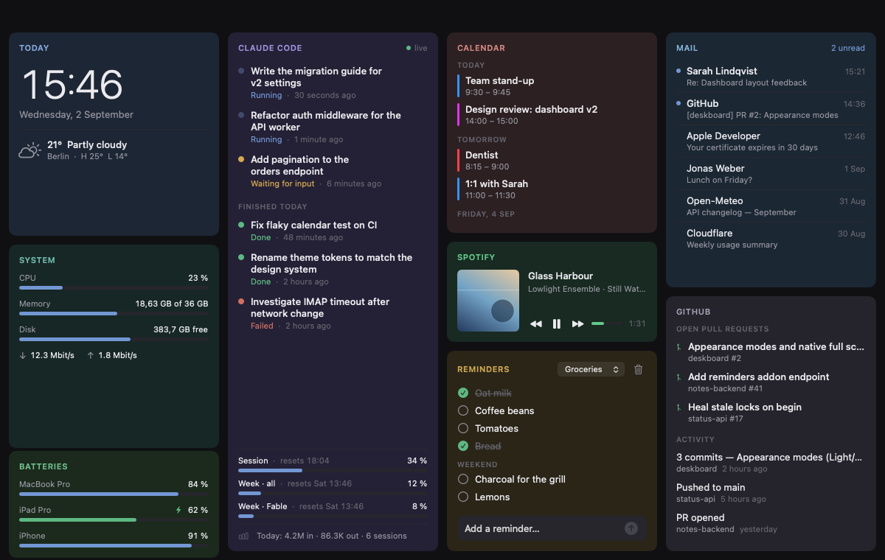

# Deskboard

A calm, single-screen macOS dashboard built for an iPad used as a second display
(Sidecar). Nine widgets, three appearances, native full screen, no accounts of
its own — everything it shows comes from services you already use.

| Light | Dark | Dark Color |
|---|---|---|
|  |  |  |

*Screenshots use the built-in demo data (`--demo`), not real accounts.*

## Widgets

| Widget | What it shows | Source |
|---|---|---|
| **Today** | Clock, date, current weather with today's high/low | [Open-Meteo](https://open-meteo.com) (no API key; city set in Settings) |
| **System** | CPU, memory, disk, network throughput of this Mac | Mach / IOKit / `getifaddrs`, sampled every 3 s |
| **Batteries** | Mac battery plus paired iPad/iPhone levels | IOKit; iOS devices via [libimobiledevice](https://libimobiledevice.org) (USB or Finder Wi-Fi sync) |
| **Claude Code** | Live Claude Code sessions (running / waiting / done), `/usage` rate-limit bars, today's token totals | A small status API you host (contract below), the local Claude Code login, local transcripts |
| **Calendar** | Next 7 days from every calendar in the macOS Calendar app | EventKit, read-only |
| **Spotify** | What is playing on any of your devices: artwork, track, progress, previous / play-pause / next | Spotify Web API with your own developer app (PKCE login); controls need Premium |
| **Reminders** | Checklists you can tick off, add to, and clear of completed items | inTouch reminders add-on (`X-API-Key`), optional |
| **Mail** | Newest inbox messages and unread count | Built-in minimal IMAP client, read-only (`EXAMINE`, `BODY.PEEK`) |
| **GitHub** | Your open pull requests and recent activity | GitHub REST API with a PAT or your `gh` CLI login |

Widgets whose service is not configured show a one-line hint instead of an error.

## Requirements

- macOS 14 Sonoma or newer, Apple silicon or Intel
- Xcode 15+ and [XcodeGen](https://github.com/yonaskolb/XcodeGen) (`brew install xcodegen`)
- Optional: `brew install libimobiledevice` for iPad/iPhone batteries, the `gh` CLI for GitHub without a PAT

## Build

```bash
git clone https://github.com/maaxvogt/deskboard.git
cd deskboard
xcodegen generate
xcodebuild -project Deskboard.xcodeproj -scheme Deskboard -configuration Debug build
open build/Build/Products/Debug/Deskboard.app   # or open Deskboard.xcodeproj in Xcode
```

The `.xcodeproj` is generated and not checked in; `project.yml` is the source of truth.
Without a signing team the app is signed "to run locally", which works but makes macOS
ask for Calendar access again after every rebuild. To sign with your own team, copy
`project.local.yml.example` to `project.local.yml` (gitignored), enter your Team ID and
generate with `xcodegen generate --spec project.local.yml`.

## Configuration

Everything lives in the app's Settings (⌘,). Endpoints and user names are stored in
UserDefaults, every secret in the macOS Keychain under the service
`com.maxvogt.deskboard`. The app ships with no hosts, accounts or keys of its own.

| Tab | Fields |
|---|---|
| Claude | Status API base URL + bearer token |
| Mail | IMAP host, user, password (TLS on port 993) |
| GitHub | Username + PAT (classic with `repo`, or fine-grained read). Leave the token empty to reuse `gh auth token`. |
| inTouch | Backend URL + API key |
| Spotify | Client ID of your own Spotify app + Connect button (see below) |
| General | Weather city, appearance (Auto / Light / Dark / Dark Color), start in full screen, display |

**Full screen & displays.** Deskboard enters native macOS full screen on launch (toggle in
General) and remembers which display it was on. Move it with the Display picker in
Settings or ⇧⌘M (View → Move to Next Display).

### Spotify widget

1. Create an app at [developer.spotify.com/dashboard](https://developer.spotify.com/dashboard)
   (Web API, no SDKs needed) and add `deskboard://spotify-callback` as a redirect URI.
2. Paste its Client ID into Settings → Spotify and click **Connect Spotify…**. The browser
   asks for `user-read-playback-state`, `user-modify-playback-state` and
   `user-read-currently-playing`, then hands the code back through the `deskboard://` URL
   scheme (Authorization Code with PKCE — there is no client secret).
3. Only the refresh token is stored (Keychain). The widget polls `/v1/me/player` every 3 s and
   interpolates the progress bar in between; previous / play-pause / next call the player
   endpoints, which Spotify only allows for Premium accounts.

### Claude Code widget

The session list talks to a tiny REST + WebSocket API that Claude Code hooks feed. My
implementation (`claude-status`) is not public yet; the contract the widget expects is:

```
GET   {base}/api/tasks?filter=all         → [Task] or { "tasks": [Task] }
PATCH {base}/api/tasks/{id}  {"status"}   → manual override from the context menu
WS    {base}/api/stream?token={token}     → {"type": "task.created|task.updated|task.deleted", "task": Task}

Task = { id, title, status: queued|running|waiting|done|failed, source, project?,
         created_at, updated_at, completed_at? }   // timestamps in ms since epoch
```

A `running` task without an update for 5 minutes is shown as "Stalled?". A live
transition into `waiting` triggers a macOS notification.

The three rate-limit bars mirror `/usage` in Claude Code. They read your Claude Code
OAuth token from the Keychain item Claude Code itself maintains (via `security
find-generic-password -s "Claude Code-credentials"`) and call the same undocumented
Anthropic endpoint the CLI uses. That endpoint may change without notice; the parser is
lenient and the bars simply disappear if it does. The token is only ever sent to
`api.anthropic.com` and is never logged.

Today's token totals are summed from the local transcripts in `~/.claude/projects`.

## Privacy & security notes

- **Not sandboxed, hardened runtime off.** The app reads `~/.claude/settings.json`
  (to pick up a `CLAUDE_STATUS_TOKEN` default) and `~/.claude/projects`, and spawns
  `gh`, `security`, `idevice_id`/`ideviceinfo` with absolute paths. This is deliberate for
  a local dashboard and is why there is no App Store build.
- **Secrets never leave the Keychain** except to the host you configured for that widget
  (or `api.anthropic.com` / `api.github.com` / `api.spotify.com` for the Claude, GitHub and
  Spotify widgets).
- **Mail is read-only.** The IMAP client opens the mailbox with `EXAMINE` and fetches
  headers with `BODY.PEEK`, so nothing is ever marked as read or changed.
- **Logs** go to the unified log (`subsystem com.maxvogt.deskboard`) and contain status
  codes and server error bodies, never credentials or message content.
- The WebSocket token travels as a query parameter because that is what the status API
  accepts; run that API behind TLS.

## Development

```bash
# Snapshot the window to a PNG after ~8 s without screen-recording permission (Debug build).
# --demo shows fixture data, --appearance pins the look for this launch only.
build/Build/Products/Debug/Deskboard.app/Contents/MacOS/Deskboard \
  --demo --appearance=light --snapshot=/tmp/deskboard.png
```

- One widget = one folder under `Deskboard/Widgets/` with a SwiftUI view and an
  `@Observable` service; add it to `DashboardView`.
- All colours, fonts and metrics come from `Support/Theme.swift`; every colour token has a
  light / dark / dark-colour value. Card chrome lives only in `WidgetCard`.
- Demo fixtures live in `Support/Demo.swift`.

## License

[MIT](LICENSE)
